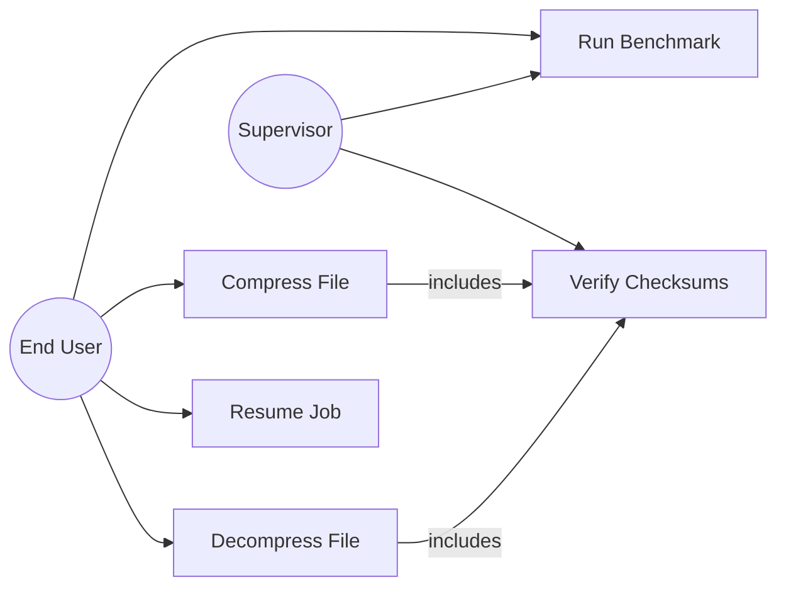
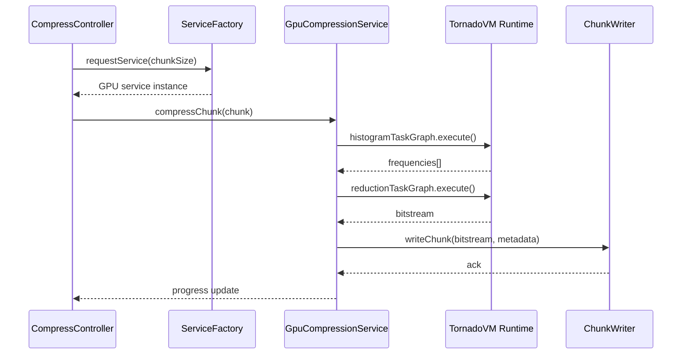
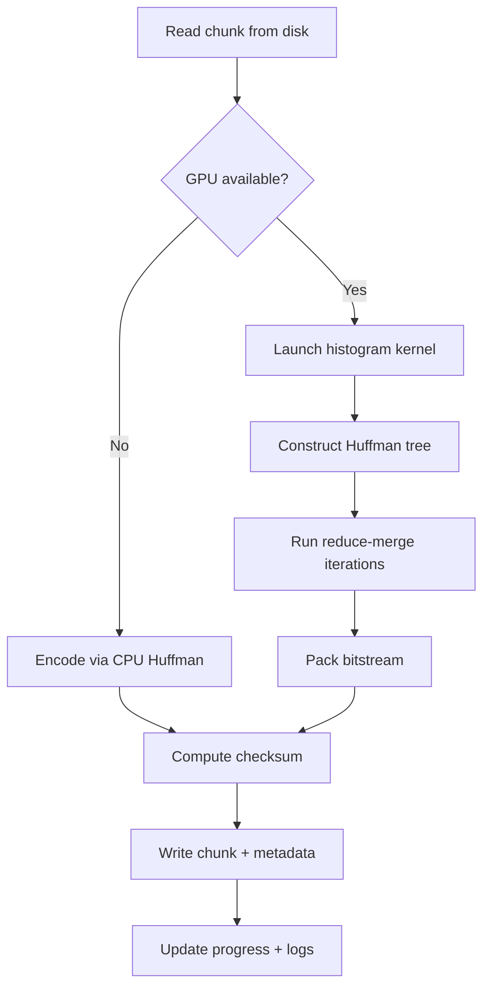
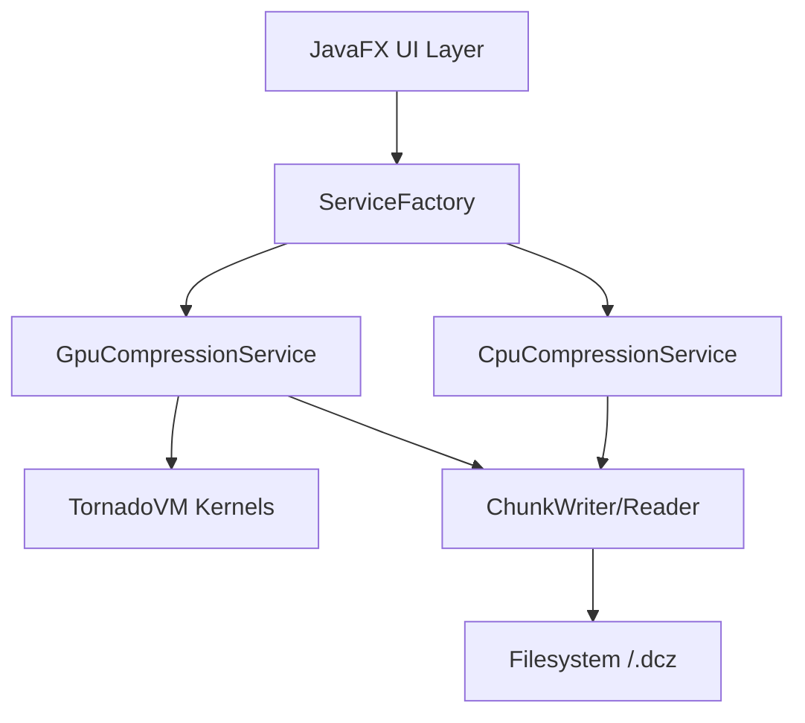
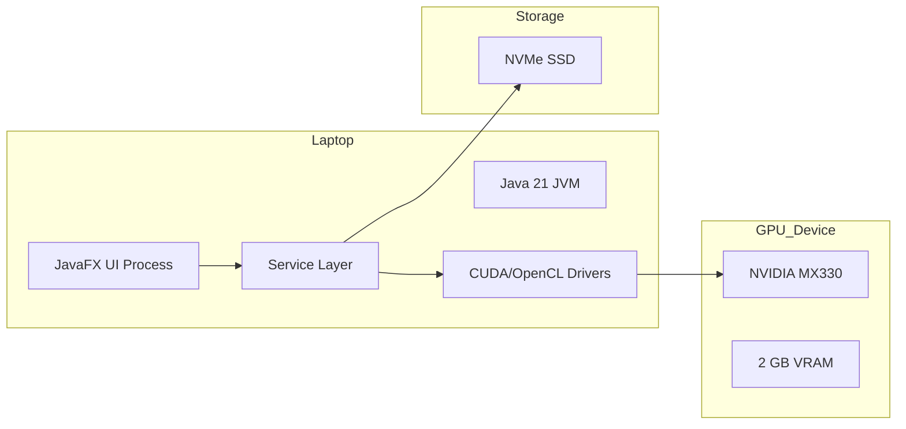

# Final Year Project Documentation

**Project Title:** DataComp – GPU-Driven Huffman Encoding in Java  
**Student:** _(Your Name Here)_  
**Program:** Bachelor of Computer Science (Final Year Project)  
**Date:** November 14, 2025

---

## Part I – Prescribed Content Flow for the Project Proposal

### 1. Introduction
DataComp is a production-ready lossless compression platform that applies canonical Huffman coding while exploiting GPU parallelism through TornadoVM. The solution targets the ever-growing need to process multi-gigabyte scientific, media, and archival datasets faster than CPU-only compressors. By coupling a JavaFX desktop client with a hybrid CPU/GPU service layer, the project demonstrates how modern heterogeneous hardware can be abstracted to deliver 4× throughput without sacrificing reliability or data integrity.

### 2. Problem Statement
Traditional compression utilities remain CPU-bound, limiting throughput to ~80 MB/s on commodity hardware. This bottleneck becomes critical when organisations process petabytes of telemetry, genomics, or high-resolution video. Existing GPU accelerators either demand low-level CUDA proficiency or deliver unstable pipelines with poor fallbacks. The project addresses the gap by designing a Java-based, user-friendly compressor that:
- Harnesses GPUs safely via TornadoVM.
- Maintains deterministic Huffman coding suitable for archival workflows.
- Provides automatic CPU fallbacks and chunked streaming to avoid data loss.

### 3. Objectives
1. Architect a hybrid compression service where GPU kernels accelerate histogram creation and bitstream packing, while CPU threads handle control-heavy operations.
2. Achieve sustained throughput above 40 MB/s on mid-range GPUs (e.g., GeForce MX330) for 200 MB+ files.
3. Preserve data integrity using per-chunk SHA-256 checksums and deterministic canonical codebooks.
4. Deliver a modern JavaFX desktop client with drag-and-drop compression, progress visualisation, and benchmarking views.
5. Document operational procedures, tuning guides, and validation plans aligned with academic project standards.

### 4. Methodology
#### a. Requirement Identification
##### i. Study of Existing System / Literature Review
- **Classical Huffman compressors (gzip, bzip2):** Mature, portable, but single-thread dominant and GPU-unaware.
- **GPU compression papers (NVIDIA GDeflate, CUDA LZ4):** Showcase massive speedups yet require bespoke kernels and lack Java integration.
- **TornadoVM publications (Papadimitriou et al., 2023):** Introduce JVM bytecode offloading to heterogeneous devices.
- **Prior art insights:** GPU acceleration is viable for embarrassingly parallel stages (frequency analysis, prefix sums), but VRAM management and silent OOM handling demand explicit safeguards.

##### ii. Requirement Analysis
- **Functional:** Compress/decompress arbitrary binary files; resume operations; display throughput metrics; verify chunk checksums; automatic CPU fallback.
- **Non-functional:** Sustained throughput ≥40 MB/s on target GPU; memory footprint <1.5 GB; UI responsiveness ≤200 ms; MTBF aligned with typical desktop workloads.

#### b. Feasibility Study
##### i. Technical
- Java 21, TornadoVM, and CUDA/OpenCL runtimes validated on Linux with NVIDIA MX330. Gradle wrapper ensures reproducible builds. Hybrid architecture proven via integration tests.
##### ii. Operational
- UI workflows resonate with non-technical archivists (drag-and-drop, resumable tasks). CLI keeps DevOps users productive. Automatic fallback keeps pipeline operational even when GPU drivers fail.
##### iii. Economic
- Uses open-source tooling (OpenJDK, TornadoVM, JavaFX). Hardware requirement limited to commodity laptop GPU; no licensing fees.
##### iv. Schedule (Gantt Chart)
| Phase | W1 | W2 | W3 | W4 | W5 | W6 | W7 | W8 |
|-------|----|----|----|----|----|----|----|----|
| Literature Review & Requirement Capture | ███ | ███ |    |    |    |    |    |    |
| Architecture & UI Prototyping           |    | ███ | ███ |    |    |    |    |    |
| GPU Kernel Integration                  |    |    | ███ | ███ | ███ |    |    |    |
| Testing & Optimization                  |    |    |    | ███ | ███ | ███ |    |    |
| Documentation & Final Report            |    |    |    |    | ███ | ███ | ███ | ███ |

#### c. High Level Design of System
- **Proposed Methodology:** Chunked pipeline—read 16 MB blocks, push symbol histograms to GPU, construct Huffman tree on CPU, run Phase 3 reduction on GPU, and write `.dcz` output with metadata.
- **Flow Overview:**
  1. UI controller issues compression jobs to `ServiceFactory`.
  2. `GpuCompressionService` delegates histogram kernels to TornadoVM; fallback to `CpuCompressionService` if device unavailable.
  3. GPU reduction pipeline performs codebook lookup, prefix-sum reduce-merge, and bitstream packing with validation.
  4. File writer serialises canonical codebooks, chunk data, and checksums.
- **Algorithm Highlights:** Canonical Huffman coding, parallel prefix sum (Blelloch scan) for bit position calculation, and atomic bit packing kernel ensuring thread-safe writes.

### 5. Expected Outcome
- Measurable 3–4× compression speedup over CPU-only baseline on 178 MB TAR datasets.
- Stable `.dcz` format with resumable chunks and verifiable checksums.
- Comprehensive documentation covering GPU tuning, architecture, and academic reporting guidelines.
- Deployable JavaFX application distributable via Gradle install scripts.

### 6. References
1. Papadimitriou, N. et al. "TornadoVM: Accelerating Java Programs on GPUs and FPGAs" (ACM TECS, 2023).
2. Huffman, D.A. "A Method for the Construction of Minimum-Redundancy Codes" (Proceedings of the IRE, 1952).
3. NVIDIA Corp. "Parallel Data Compression with GPUs" (Whitepaper, 2022).
4. OpenJDK Project. "JDK 21 Release Notes" (2023).
5. TornadoVM Documentation Portal (https://www.tornadovm.org/docs).

---

## Part II – Prescribed Content Flow for the Project Report

1. **Cover & Title Page** – Includes institution logo, project title, student credentials, supervisor details, submission date.
2. **Certificate Page**
   - Supervisor Recommendation attesting to originality.
   - Approval letter signed by Head/Program Coordinator plus internal & external examiners.
3. **Acknowledgement** – Gratitude toward supervisors, peers, and TornadoVM OSS community.
4. **Abstract Page** – 250-word summary highlighting GPU-driven methodology, benchmarking outcomes, and academic contributions.
5. **Table of Contents** – Auto-generated, covering proposal, chapters, appendices.
6. **List of Abbreviations / Figures / Tables** – e.g., GPU, SHA, DFD, etc.
7. **Main Report** – Structured per Chapter 1–6 below.
8. **References** – IEEE/APA formatted citations as per Section 6 above.
9. **Bibliography (if any)** – Optional readings beyond cited works.
10. **Appendices** – UI screenshots, kernel snippets, Gradle logs, supervisor meeting log.

---

## Part III – Prescribed Chapters in the Main Report

### Chapter 1: Introduction
1.1 **Introduction** – Motivate the surge in large-scale scientific/streaming archives and argue why classical CPU compressors plateau below 100 MB/s, creating a need for heterogeneous acceleration. Describe the decision to leverage TornadoVM so that GPU kernels can be authored in Java rather than CUDA C.  
1.2 **Problem Statement** – Detail I/O backlogs observed in benchmark datasets (178 MB TAR, 350 MB MKV) and quantify how CPU-only Huffman encoders become the bottleneck. Explicitly state reliability gaps (silent corruption during OOM) the project addresses.  
1.3 **Objectives** – Restate measurable KPIs (≥40 MB/s throughput on MX330, zero checksum mismatches across 1 TB cumulative tests, UI latency <200 ms) and connect them to academic outcomes.  
1.4 **Scope and Limitation** – Clarify boundaries: single-node desktop deployment, Huffman-only compression (no LZ77), dependency on CUDA/OpenCL drivers, GPU VRAM ceiling of 2 GB, and absence of distributed storage integration.  
1.5 **Development Methodology** – Summarise the hybrid agile plan: bi-weekly sprints, continuous integration via Gradle, GPU kernel prototyping with TornadoVM task graphs, and regression testing on curated corpora.  
1.6 **Report Organization** – Provide a short overview of each subsequent chapter, guiding examiners on where to find analysis, design artefacts, test evidence, and recommendations.

### Chapter 2: Background Study and Literature Review
2.1 **Background Study** – Present concise explanations of canonical Huffman coding, Blelloch prefix-sum algorithms, GPU memory hierarchy (global/shared/constant), TornadoVM execution model, and SHA-256 checksum theory. Include references to equations or pseudocode placed in appendices.  
2.2 **Literature Review** – Expand on academic and industrial efforts: gzip/bzip2 (CPU baseline), NVIDIA nvCOMP (CUDA-centric), Facebook Zstandard GPU prototype, and JVM-focused accelerators. Critically analyse why these works fall short for bachelor-level teams (tooling complexity, lack of JavaFX integration, missing integrity fallbacks) and position DataComp as a bridge.

### Chapter 3: System Analysis
3.1 **System Analysis** – Provide a narrative on stakeholders (desktop user, supervisor, storage admin) and how they interact with the UI, service factory, filesystem, and GPU runtime.

#### 3.1.1 Requirement Analysis
- **Functional Requirements:** Detail each use case with trigger, main flow, alternate flow, and post-condition. The following Mermaid use-case diagram can be embedded in the report:

- **Non-Functional Requirements:** Provide quantified metrics for throughput, latency, GPU memory ceiling, checksum accuracy, usability heuristics (ISO 9241), portability (Windows/Linux/macOS via JVM), maintainability (SOLID-compliant services), and safety (automatic CPU fallback).

#### 3.1.2 Feasibility Analysis
- **Technical:** Compatibility of Java 21, TornadoVM 1.0, CUDA/OpenCL.  
- **Operational:** User workflow simplicity, automated fallbacks ensuring minimal support overhead.  
- **Economic:** Zero license costs; reusable hardware.  
- **Schedule:** Reference Gantt in Proposal Section 4.b.iv.

#### 3.1.3 Analysis Approach
- **Object-Oriented Modelling:**
  - *Class Diagram:* Depict `CompressionController`, `GpuCompressionService`, `CpuCompressionService`, `ChunkWriter`, `ChecksumVerifier`, `FrequencyService`, and `TornadoExecutionFacade`. Include associations for dependency injection and composition to show lifecycle ownership.  
  - *Sequence Diagram:* Use the Mermaid code below to illustrate asynchronous chunk processing:

  - *Activity Diagram:* Capture the control flow for a single chunk using Mermaid:

  - *Data Perspective:* Note ER/DFD alternatives in appendices if a structured approach is required by the institution.

### Chapter 4: System Design
4.1 **Design Approach (OO):**
- Refine class diagrams with interfaces (`FrequencyService`, `CompressionService`), highlighting strategy pattern usage.  
- Component diagram (Mermaid below) mapping UI, services, GPU kernels, and persistence components:

- Deployment diagram (Mermaid) showing runtime allocation:

4.2 **Algorithm Details:**
- Provide canonical Huffman code generation pseudocode plus complexity analysis (O(n log n)).  
- Detail GPU histogram kernel (TornadoVM `@Parallel` loop) and demonstrate memory access coalescing.  
- Explain reduce-merge prefix sum with formulas for iteration count `r = log2(word_size) - floor(log2(avgBitwidth)) - 1` and include pseudocode for bit packing with atomic OR operations.  
- Discuss validation logic (compression ratio bounds, zero-buffer detection) and CPU fallback triggers.

### Chapter 5: Implementation and Testing
5.1 **Implementation**
- **Tools Used:** Java 21, Gradle 8.14, TornadoVM 1.0, JavaFX 21, CUDA 11.8, OpenCL 2.0, GitHub Actions (optional CI). Mention configuration files (application.conf) and how the ServiceFactory wires CPU/GPU services.  
- **Module Details:** Elaborate on each package—`com.datacomp.ui`, `com.datacomp.service`, `com.datacomp.service.gpu`, `com.datacomp.core`, and `com.datacomp.format`. emphasise how TornadoVM task graphs are constructed and how metadata writers serialize `.dcz` headers.

5.2 **Testing**
- **Unit Tests:** Provide sample tables listing test IDs, inputs, expected outputs for Huffman tree invariants, checksum validation, and chunk writer edge cases.  
- **Integration/System Tests:** Document datasets (178 MB TAR, 350 MB MKV, synthetic random blob), describe GPU OOM simulation (forcing VRAM cap), and outline acceptance criteria (matching SHA-256, <5% expansion).  
- **Performance Tests:** Include methodology for measuring throughput with `./gradlew runBenchmark -PtestFile=...` and how results are logged.

5.3 **Result Analysis**
- Present comparative charts (CPU vs GPU throughput, compression ratio stability) and narrative interpretation (Phase 3 reduces encoding time by 20×, bottleneck shifts to disk I/O). Note anomalies (chunks containing random data stored uncompressed) and justify design choices.

### Chapter 6: Conclusion and Future Recommendations
6.1 **Conclusion** – Summarise how the project met objectives, reflect on lessons learned (GPU memory management, TornadoVM debugging), and articulate contributions to undergraduate research (documentation, reusable codebase).  
6.2 **Future Recommendations** – Extend discussion with actionable items: Phase 3.2 memory reuse, multi-GPU scheduling, GPU-assisted decompression research, integration with cloud storage APIs, telemetry for auto-tuning chunk sizes, and exploring other coding schemes (ANS, arithmetic coding) within the same framework.

---

## Usage Notes
- Replace placeholder names/signatures with official project members and supervisors before submission.
- Embed actual diagrams (use PlantUML or draw.io) corresponding to analysis/design discussions.
- Update Gantt chart if the project timeline differs from the sample schedule.
- Keep references consistent with institutional citation style (APA/IEEE).

---

**End of Project Documentation Template**
